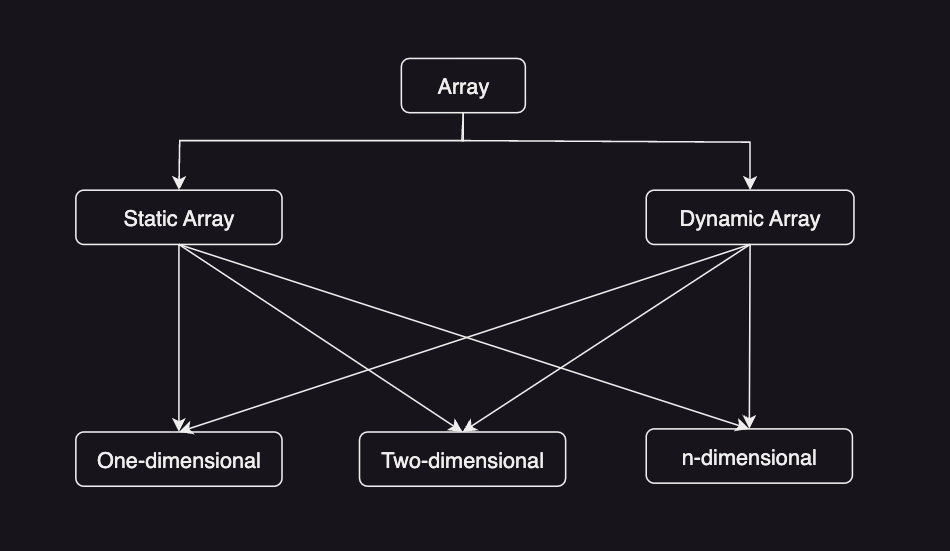
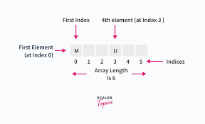
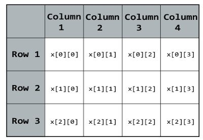

# Cấu trúc dữ liệu & giải thuật
Đây là kho lưu trữ trên GitHub mà tôi bỏ rất nhiều tâm huyết, tập trung vào cấu trúc dữ liệu và thuật toán mà tôi đã được học từ nhiều nguồn khác nhau và đúc kết lại từ góc nhìn cá nhân. Kho lưu trữ cung cấp mã nguồn ví dụ bằng Golang và các bài tập lập trình để người dùng thực hành và nâng cao kỹ năng lập trình của họ cũng như hiểu sâu hơn về các khái niệm cơ bản trong lĩnh vực này. Mã nguồn và bài tập được sắp xếp theo từng chủ đề cụ thể và có hướng dẫn chi tiết giúp người dùng dễ dàng học và áp dụng vào dự án của mình.

## Cấu trúc dữ liệu
### 1. Mảng (Array)

    

 
**Mảng (Array)**: là cấu trúc dữ liệu bao gồm một nhóm các phần tử giá trị hoặc biến, mỗi phần tử trong mảng có thể là **number**, **string**, **object** và được xác định ít nhất bằng một chỉ số (index) hoặc khoá (key). Index của mảng luôn bắt đầu từ 0 và kết thúc ở n - 1 (n là số phần tử).

- **Mảng tĩnh (Static Array)**: mảng có kích thước cố định khi khai báo và không thể thay đổi trong thời gian chạy, khi tạo cần xác định số lượng phần tử phù hợp.
- **Mảng tĩnh (Static Array)**: mảng có thể thay đổi kích thước trong thời gian chạy, khi không có đủ dung lượng để thêm các phần tử mới, nó sẽ tự thay đổi kích thước cho phù hợp.
- **Mảng một chiều (One-dimensional Array)**: là một cấu trúc dữ liệu tuyến tính trong đó các phần tử được sắp xếp trong một hàng hoặc một cột, mỗi phần tử được đánh dấu và truy cập theo chỉ mục.

    

- **Mảng hai chiều (Two-dimensional Array)**: là một cấu trúc dữ liệu bảng bao gồm các hàng và cột, mỗi phần tử trong mảng được truy cập bởi 2 chỉ số, một chỉ số hàng và một chỉ số cột.

    

- **Mảng đa chiều (Multi-dimensional Array)**: à một cấu trúc dữ liệu mà mỗi phần tử trong mảng là một mảng khác. Nó cho phép lưu trữ và truy cập dữ liệu theo nhiều chiều khác nhau.

### 2. Danh sách liên kết (Linked List)
### 3. Ngăn xếp (Stack)
### 4. Hàng đợi (Queue)
###
###
###
###
###
###
###